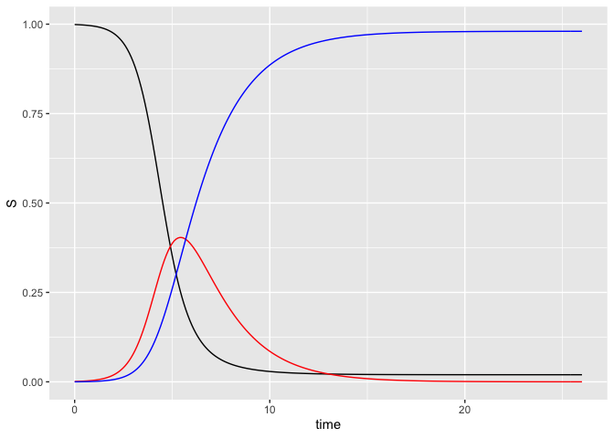
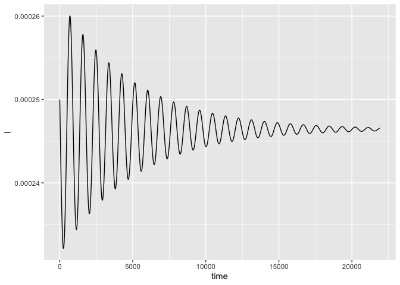
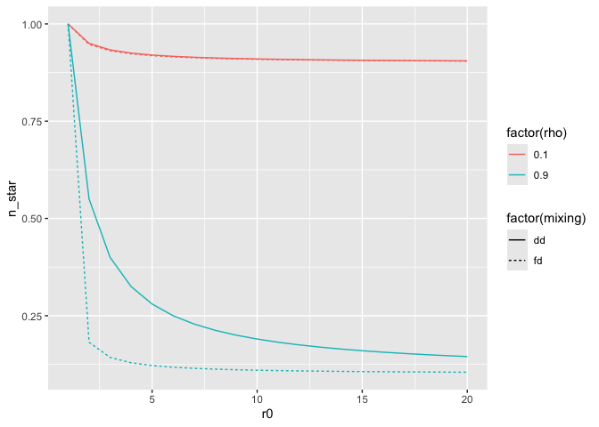
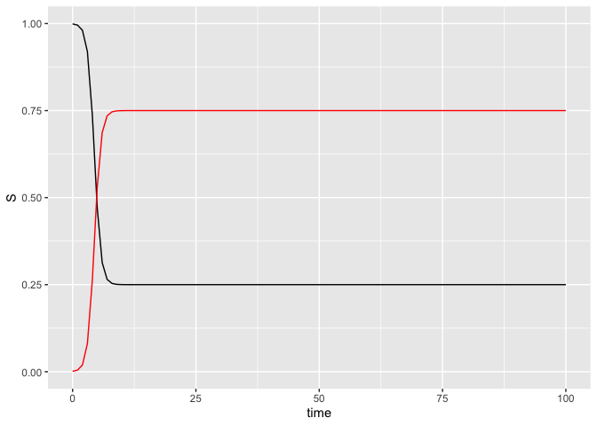

Compartmental models
================
Ravi Brenner

- [1 Building up compartmental
  models](#1-building-up-compartmental-models)
  - [1.1 Model structure](#11-model-structure)
  - [1.2 Deriving the parameters](#12-deriving-the-parameters)
    - [1.2.1 Density dependent and frequency dependent
      transmission](#121-density-dependent-and-frequency-dependent-transmission)
- [2 SIR model without demography](#2-sir-model-without-demography)
  - [2.1 Epidemic Burnout](#21-epidemic-burnout)
- [3 SIR model with demography](#3-sir-model-with-demography)
  - [3.1 Endemic equilibrium](#31-endemic-equilibrium)
  - [3.2 Oscillations](#32-oscillations)
  - [3.3 Average age of infection](#33-average-age-of-infection)
- [4 SI models - infection induced
  mortality](#4-si-models---infection-induced-mortality)
  - [4.1 Mortality throughout
    infection](#41-mortality-throughout-infection)
    - [4.1.1 Density dependent
      transmission](#411-density-dependent-transmission)
    - [4.1.2 Frequency dependent
      transmission](#412-frequency-dependent-transmission)
  - [4.2 Mortality late in infection](#42-mortality-late-in-infection)
- [5 SIS model (no immunity)](#5-sis-model-no-immunity)
- [6 SIRS model - waning immunity](#6-sirs-model---waning-immunity)
- [7 SEIR model - latent period](#7-seir-model---latent-period)
- [8 carrier state](#8-carrier-state)
- [9 discrete time models](#9-discrete-time-models)
- [10 estimating parameters](#10-estimating-parameters)
- [11 Putting it all together](#11-putting-it-all-together)

Notes and code following chapter 2 of Modeling Infectious Diseases in
Humans and Animals by Matt J. Keeling and Pejman Rohani.

``` r
library(tidyverse)
library(deSolve)
```

# 1 Building up compartmental models

Unfortunately, this chapter jumps right in to some confusing terminology
and derivations. I will deal with each of these issues in turn.

## 1.1 Model structure

Basically, capital letters are used to represent different compartments,
and differential equations are solved to get deterministic solutions. In
the most intuitive (and famous) SIR model, S = Susceptible, I =
Infected/Infectious, and R = Recovered. For a closed population of size
N, we assume S + I + R = N. People move from S to I and from I to R, and
that’s it. How fast people move from S to I depends on how many people
are in S and I.

The model equations look like this (we will derive these next):

$\frac{dS}{dt} = -\beta SI$

$\frac{dI}{dt} = \beta SI  - \gamma I$

$\frac{dR}{dt} = \gamma I$

## 1.2 Deriving the parameters

So for the SIR model, there are 2 terms to worry about:

1.  The S–\>I “transmission” term

2.  the I–\>R recovery term

(note that R is just 1 - S - I)

2)  is actually fairly straightforward. If someone is infectious for *t*
    period of time, then their time spend infectious is equal to
    $1/t = \gamma$. We call $\gamma$ the recovery rate.

3)  is more complicated, but it works like this. The rate that people
    get infected depends on the number of contacts between susceptible
    and infectious people, and the per-person probability of acquiring
    infection, given contact (this is often called the force of
    infection, $\lambda$). Here’s where it gets complicated.

### 1.2.1 Density dependent and frequency dependent transmission

I found Keeling and Rohani’s explanation of this very confusing. But
[this](https://parasiteecology.wordpress.com/2013/10/17/density-dependent-vs-frequency-dependent-disease-transmission/)
blog post was very helpful in helping me understand.

In density-dependent (DD) transmission, the contact rate between S and I
depends on the density within the physical space. Think of a crowded
subway car and a respiratory disease.

In frequency dependent (FD) transmission, the contact rate does not
depend on population density. Think of a crowded subway car and an STI.
One is not more likely to contract an STI on a subway car if it is full
of more or less people.

The transmission terms look like this:

$DD: \frac{dI}{dt} = \lambda S$

$FD: \frac{dI}{dt} = \lambda' S$

And those $\lambda$ values look like this:

$DD: \lambda = c * v * I/N$

$FD: \lambda' = c' * v * I/N$

So lambda, the force of infection, is the product of 1) the
probability/rate that a contact happens between individuals (c or c’),
2) the probability/rate that one of those contacts is infected (I/N),
and 3) the probability/rate that a contact between an S and an I
individual results in transmission (v). You can see that the only thing
that changes is c/c’, the probability/rate that people come into contact
(think of the subway example again).

In DD, that contact rate will increase as some function of the density
(people/area, or N/A) of people in the space. So we can say that
$c = k * N/A$. In theory this could be nonlinear too.

In FD, that contact rate will be constant, so $c'=k$.

Putting this together, we get

$DD: \frac{dI}{dt} = cv\frac{I}{N}S = k\frac{N}{A}v\frac{I}{N}S = k\frac{1}{A}vIS$

$FD: \frac{dI}{dt} = c'v\frac{I}{N}S = kv\frac{I}{N}S$

If we take A to be a constant (which can be an OK assumption if we’re
modeling a consistent area over time), we can combine all constant terms
into one:

$DD: \frac{dI}{dt} = \beta SI$

$FD: \frac{dI}{dt} = \beta' SI/N$

There are some more possible complications here, but this is good for
now.

One note is that K&R use S, I, and R to represent proportions, and X, Y,
and Z to represent the numbers of people in each compartment. In fact in
their terminology we should really have these terms:

$DD: \frac{dY}{dt} = \beta XY$

$FD: \frac{dY}{dt} = \beta' XY/N = \beta SI$

This may seem like overkill detail, but these details become important
when population size changes (e.g. with birth and death or migration) or
if we are trying to model something across a range of population sizes.

# 2 SIR model without demography

Returning to the basic model (note this is FD). The full terms are:

$\frac{dS}{dt} = -\beta SI$

$\frac{dI}{dt} = \beta SI  - \gamma I$

$\frac{dR}{dt} = \gamma I$

$\beta$ here is the number of people infected per unit time per infected
person.

$\gamma$ is the recovery rate, and $1/\gamma$ is the average infectious
period.

Note that S + I + R must = 1

If we focus on $\frac{dI}{dt} = I (\beta S  - \gamma)$, some interesting
things pop out. If $S(0) < \frac{\gamma}{\beta}$, dI/dt is \< 0 and
infection “dies out.” Another way of thinking about this is that if
$S(0) > \frac{\gamma}{\beta}$, the infection will grow. We can think of
$\frac{\gamma}{\beta}$ as the removal rate from the infectious
compartment. The inverse is called the basic reproductive ratio,
$R_0 = \frac{\beta}{\gamma}$ (“R naught” or “R not”), defined as the
average number of secondary cases arising from an average primary case
in an entirely susceptible population.

In a closed population, a disease can only grow if the fraction of
susceptibles S is greater than $1/R_0$.

We can create this model in R:

``` r
sirmod <- function(t, state, params){
  # pull listed inputs into environment as names variables
  with(as.list(c(state,params)),{
    # define equations
      dS = -beta * S * I 
      dI = beta*S*I - gamma*I
      dR = gamma * I
      
      list(c(dS,dI,dR))
  })
}

times = seq(0,26, by=1/10) #26 weeks, in discrete units
state = c(S = 0.999, I = 0.001, R = 0) # initial state values
params = c(beta = 2, gamma = 1/2, N = 1) # parameters
# beta = 1 means each infected can infect 1 people per week
# gamma = 1/2 means the infectious period is 2 weeks

sir_out <- ode(y = state, t = times, func = sirmod, parms = params) |> 
  as_tibble() |>
  mutate(across(everything(), as.numeric))
```

Plot model

``` r
sir_out |>
  ggplot(aes(x = time)) + 
  geom_line(aes(y = S)) + 
  geom_line(aes(y = I),color = "red") + 
  geom_line(aes(y = R),color = "blue")
```

<!-- -->

Final epidemic size

``` r
final_size = rootSolve::runsteady(y=state,times=c(0,100), func=sirmod, parms=params)
final_size$y
```

    ##            S            I            R 
    ## 1.980853e-02 2.270720e-08 9.801914e-01

``` r
#alternatively...assuming time is long enough
sir_out[nrow(sir_out),]
```

    ## # A tibble: 1 × 4
    ##    time      S         I     R
    ##   <dbl>  <dbl>     <dbl> <dbl>
    ## 1    26 0.0198 0.0000559 0.980

## 2.1 Epidemic Burnout

Some interesting math here, but the point to flag is:

The chain of transmission eventually breaks due to the decline in
infectives, not due to a complete lack of susceptibles.

In fact, there will (almost always) remain some proportion of
susceptibles who are uninfected at the end.

# 3 SIR model with demography

Add in a mortality rate $\mu$, with average lifespan equal to $1/\mu$.

Here, we are also assuming that $\mu$ is the population’s birth rate
(hence the positive $\mu$ in the dS equation)

$\frac{dS}{dt} = \mu -\beta SI  - \mu S$

$\frac{dI}{dt} = \beta SI  - \gamma I - \mu I$

$\frac{dR}{dt} = \gamma I - \mu R$

We again rearrange $\frac{dI}{dt} = I(\beta S  - (\gamma + \mu))$, to
find that $R_0 = \frac{\beta}{\gamma + \mu}$

Note S + I + R here must still be = 1

``` r
sir_demo_mod <- function(t, state, params){
  # pull listed inputs into environment as names variables
  with(as.list(c(state,params)),{
    # define equations
      dS = mu -(beta * S * I ) - mu*S
      dI = (beta*S*I) - gamma*I - mu * I
      dR = gamma * I - mu*R
      
      # dead = mu*S + mu*I + mu*R
      # born = mu*N
      
      list(c(dS,dI,dR))
  })
}

times = seq(0,26, by=1/10) 
state = c(S = 0.999, I = 0.001, R = 0) # initial state values
params = c(beta = 2, gamma = 1/2, mu = 0.0003, N = 1) # parameters

sir_demo_out <- ode(y = state, t = times, func = sir_demo_mod, parms = params) |> 
  as_tibble() |>
  mutate(across(everything(), as.numeric))
```

plot model

``` r
sir_demo_out |>
  ggplot(aes(x = time)) + 
  geom_line(aes(y = S)) + 
  geom_line(aes(y = I),color = "red") + 
  geom_line(aes(y = R),color = "blue")
```

<!-- -->

## 3.1 Endemic equilibrium

What happens at equilibrium when dS = dI = dR = 0?

There is a disease free equilibrium when S = 1, I = R = 0.

In endemic equilibrium, we find $S^{*}= (\gamma + \mu) / \beta = 1/R_0$

“In the SIR model with births and deaths, the endemic equilibrium is
characterized by the fraction of susceptibles in the population being
the inverse of $R_0$.”

Can plug that in to find that
$I^{*} = \frac{\mu}{\gamma + \mu}(1-\frac{1}{R_0}) = \frac{\mu}{\beta}(R_0 -1)$.
(I think there is typo in K&R here).

($R^{*}$ is just $1-S^{*} -I^{*}$ here)

This requires $R_0 > 1$ for endemic equilibrium, otherwise the
disease-free equilibrium will hold.

``` r
r0 <- params["beta"] / (params["gamma"] + params["mu"])
I_star = (params["mu"] / params["beta"]) * (r0-1)
r0
```

    ##     beta 
    ## 3.997601

``` r
I_star 
```

    ##           mu 
    ## 0.0004496402

## 3.2 Oscillations

K&R discuss precisely *how* equilibrium is approached. It turns out is
is a damped oscillator, bouncing up and down but gradually closing in on
the equilibrium value. They note “the period of oscillations changes
with the transmission rate ($\beta$) and the infectious period
($1/\gamma$). We note that (relative to the infectious period) the
period of oscillations becomes longer as the reproductive ratio
approaches one; this is also associated with a slower convergence toward
the equilibrium.”

``` r
times = seq(0,60*365, by=1) 
state = c(S = 0.1, I = 2.5e-4, R = 1-0.1-2.5e-4) # initial state values
params = c(beta = 520/365, gamma = 1/7, mu = 1/(70*365), N = 1) # parameters

sir_demo_out <- ode(y = state, t = times, func = sir_demo_mod, parms = params) |> 
  as_tibble() |>
  mutate(across(everything(), as.numeric))

sir_demo_out |>
  ggplot(aes(x = time, y = I)) +
  geom_line()
```

<!-- -->

There’s some linear algebra involved in calculating the periods of the
oscillations. But it turns out that it can be approximated as
$T\approx2\pi\sqrt{AG},  A = \frac{1}{\mu(R_0-1)}, G = \frac{1}{\mu+\gamma}$.

Where A is the average age at infection (more in a minute) and G
determines the average period of infection.

``` r
r0 <- params["beta"] / (params["gamma"] + params["mu"])
a = 1/(params["mu"]*(r0-1))
g = 1/(params["gamma"] + params["mu"])
t = 2*pi*sqrt(a*g);t/365
```

    ##       mu 
    ## 2.430406

## 3.3 Average age of infection

Basically, we start from the model equation
$\frac{dS}{dt} = \mu -\beta SI  - \mu S$. If $\mu$ is small, then the
average time spent in S is $1/\beta I^{*}$ at equilibrium. Substituting
in $I^{*} = \frac{\mu}{\beta}(R_0 -1)$, we find that
$A \approx \frac{1}{\mu(R_0-1)}$.

Can rewrite this as $R_0 -1 \approx L/A$ with L=lifespan = 1/mu

``` r
age_infex <- 1/(params["mu"]*(r0-1))
age_infex / 365
```

    ##       mu 
    ## 7.803902

“The mean age of (first) infection is equal to the average life
expectancy of an individual divided by $R_0 −1$.”

# 4 SI models - infection induced mortality

There are multiple possibilities here, and things start to get more
complex. I think this is an area where K&R get quite confusing and
switch notation up a lot.

We are going to strip the model down to just 2 compartments, S and I,
and assume that the only way to leave I is through death from infection
(yes this is extreme). The obvious way to do that would do be to add a
mortality $m$ term to he dI equation, where $m$ is a per-capita disease
induced mortality rate for infected individuals. In practice, it’s
easier to consider the probability $\rho$ of an infected individual
dying from infection before recovering or dying from other causes.

This changes the dI equation to:

$\frac{dI}{dt} = \beta SI  - (\gamma +\mu)I - \frac{\rho}{1-\rho}(\gamma + \mu) I$

With the new term thought of as the per capita disease induced morality
rate. We can rearrange this equation a bit:

$\frac{dI}{dt} = \beta SI   - \frac{\gamma + \mu}{1-\rho} I$

Note that as $\rho$ goes to 1, R0 drops to 0 (because new infections die
almost immediately).

This isn’t so realistic for infections where you die only later in
infection, but it is a good starting point.

## 4.1 Mortality throughout infection

Up to now, we have been assuming S, I, and R are proportions and N is
constant. Bus as N changes, the dynamics change too. If people are dying
from infection, or being born at a different rate than they die, these
assumptions need to change. We can now write

$\frac{dS}{dt} = \nu -\beta SI - \mu S$

However this glosses over how N is factored in. How we deal with N
depends on whether we’re looking at density or frequency dependent
transmission. This is where things get complicated.

### 4.1.1 Density dependent transmission

(Recall that this is like getting the flu on a crowded subway car. The
more people in the car, the more likely you are to get the disease)

S-\>X I-\>Y R-\>Z

We now have a new equation, $\frac{dN}{dt}$. In the absence of disease,

$\frac{dN}{dt} = \nu - \mu N \Rightarrow N \rightarrow \nu/ \mu$.

This gives the carrying capacity of the population. When there is no
disease, N = S, and I = R = 0.

The other model equations now look like:

$\frac{dX}{dt} = \nu -\beta XY  - \mu X$

$\frac{dY}{dt} = \beta XY  - \frac{\gamma + \mu}{1-\rho} Y$

$\frac{dZ}{dt} = \gamma Y - \mu Z$

How to calculate $R_0$? Same as before. Consider the dY equation, and
recall that $S=X/N$, so $X = NS$:

$Y(\beta X-\frac{\gamma + \mu}{1-\rho}) > 0 \Rightarrow \beta NS -\frac{\gamma + \mu}{1-\rho} > 0$

Rearrange to get

$\beta NS =\frac{\gamma + \mu}{1-\rho} \Rightarrow S^{*} = \frac{\gamma + \mu}{\beta N(1-\rho)}$

And since $R_0 = 1/S^{*}$, we get
$R_0 = \frac{\beta (1-\rho) \nu}{(\gamma + \mu)\mu}$ This is similar to
$R_0$ we found before, but with a correction term $1-\rho$ that accounts
for reduced infectivity due to disease induced mortality, and a tern for
the population size.

Note now the endemic equilibrium is:

$X^{*} = \frac{\mu + \gamma}{\beta(1-\rho)} = \frac{\nu}{\mu R_0}$

$Y^{*} = \frac{\mu}{\beta}(R_0-1)$

$Z^{*} = \frac{\gamma}{\beta}(R_0-1)$

$N^{*} = \frac{\nu}{\mu R_0}[1+(1-\rho)(R_0-1)]$

The takeaway here is: “When disease-induced mortality is added to the
SIR model with density-dependent transmission, the equilibrium and
stability properties simply reflect a change in parameters.”

### 4.1.2 Frequency dependent transmission

Before, we were able to easily switch between the count and proportion
and remove N as needed. Now since N is changing though, things get much
trickier.

The model equations now:

$\frac{dX}{dt} = \nu -\beta XY/N  - \mu X$

$\frac{dY}{dt} = \beta XY/N - \frac{\gamma + \mu}{1-\rho} Y$

$\frac{dZ}{dt} = \gamma Y - \mu Z$

Now, even when population size is reduced, each individual still has the
same average number of contacts.

You can find the equilibrium by setting the differential equations equal
to 0.

(I did not succeed in doing the algebra here. K&R skip over it.) They
find that the endemic equilibrium is:

$S^{*} = \frac{\gamma+\mu}{\beta(1-\rho)} = 1/R_0$

$I^{*} = \frac{\mu}{\beta(1-\rho)}(R_0 - 1)$

$N^{*} = \frac{\nu}{\mu}(\frac{R_0(1-\rho)}{R_0 - \rho})$

Some comments:

“Not surprisingly, infectious diseases with the highest mortalities
($\rho$ close to one) and largest $R_0$ have the greatest impact on the
population.”

Although for low mortality levels both mixing assumptions lead to
similar results, when the mortality is high the frequency-dependent
assumption leads to the largest drop in the total population size. This
is because density dependent mixing places a natural damping on
transmission, such that as the population size decreases so does the
contact rate between individuals, limiting disease spread and reducing
disease-induced mortality.

When disease-induced mortality is added to the SIR model with frequency
dependent transmission, the equilibrium and stability properties can
change substantially, especially if the probability of mortality is
high.”

## 4.2 Mortality late in infection

$\frac{dS}{dt} = \nu -\beta SI  -\mu S$

$\frac{dI}{dt} = \beta SI  - (\gamma+\mu) I$

$\frac{dR}{dt} = (1-\rho)\gamma I - \mu R$

Here, rho is the probability of an infected individual dying from the
disease. Basically, they spend the entive infectious period in the I
class, and then instead of moving to recovery, they are just removed
from the R class as a death.

# 5 SIS model (no immunity)

\$ = I -SI \$

\$ = SI - I \$

S + I = 1

Can actually solve these to find that

$I^{*} = (1-1/R_0)$

$S^{*} = 1/R_0$

$R_0 = \beta/\gamma$

As the equilibrium. Basically this means that for a disease that does
not lead to long-term immunity, the disease will persis long term in the
population if R0 \> 1. Basically it will become endemic at a level
determined by R0.

``` r
sis_mod <- function(t, state, params){
  # pull listed inputs into environment as names variables
  with(as.list(c(state,params)),{
    # define equations
      dS = -(beta * S * I ) +gamma*I
      dI = (beta*S*I) - gamma*I 

      
      list(c(dS,dI))
  })
}

times = seq(0,100, by=1) #100 days, in discrete units
state = c(S = 0.999, I = 0.001) # initial state values
params = c(beta = 2, gamma = 1/2, N = 1) # parameters

sis_mod_out <- ode(y = state, t = times, func = sis_mod, parms = params) |> 
  as_tibble()

sis_mod_out |>
  ggplot(aes(x = time)) + 
  geom_line(aes(y = S)) + 
  geom_line(aes(y = I),color = "red")
```

<!-- -->

# 6 SIRS model - waning immunity

$\frac{dS}{dt} = \mu +\omega R -\beta SI  -\mu S$

$\frac{dI}{dt} = \beta SI  - (\gamma+\mu) I$

$\frac{dR}{dt} = \gamma I - \omega R -  \mu R$

Where $\omega$ is the rate at which immunity is lost and individuals go
from R–\>S. Similar to before, $R_0 = \beta /(\gamma + \mu)$

``` r
sirs_mod <- function(t, state, params){
  # pull listed inputs into environment as names variables
  with(as.list(c(state,params)),{
    # define equations
      dS = mu -omega * R -(beta * S * I ) -mu*S
      dI = (beta*S*I) - (gamma+mu)*I 
      dR = gamma*I - omega*R - mu*R
      
      list(c(dS,dI,dR))
  })
}

times = seq(0,100, by=1) #100 days, in discrete units
state = c(S = 0.999, I = 0.001, R = 0) # initial state values
params = c(beta = 0.75, gamma = 1/2, N = 1, mu = 1/(70*12), omega = 1/(12*1)) # parameters

sirs_mod_out <- ode(y = state, t = times, func = sirs_mod, parms = params) |> 
  as_tibble()

sirs_mod_out |>
  ggplot(aes(x = time)) + 
  geom_line(aes(y = S)) + 
  geom_line(aes(y = I),color = "red") + 
  geom_line(aes(y = R),color = "blue")
```

<!-- -->

# 7 SEIR model - latent period

$\frac{dS}{dt} = \mu -\beta SI  -\mu S$

$\frac{dE}{dt} = \beta SI  -(\mu + \sigma) S$

$\frac{dI}{dt} = \sigma E - (\gamma+\mu) I$

$\frac{dR}{dt} = \gamma I -  \mu R$

The latent period (time spent infected but not infectious) is equal to
1/sigma.

And assume S + E + I + R = 1 (closed cohort).

This gives

$R_0 = \frac{\beta}{\mu+\gamma} \frac{\sigma}{\mu+\sigma}$

Basically, it’s the same R0 as the SIR model, but some individuals in E
die before reaching I, so they do not contribute to transmission.
Usually, the second fraction is ~1 (since mu is very small compared to
sigma–people’s lifespan (in years) is usually longer than the time spend
in latent period (often days or weeks)).

Although the SIR and SEIR models behave similarly at equilibrium (when
the parameters are suitably rescaled), the SEIR model has a slower
growth rate after pathogen invasion due to individuals needing to pass
through the exposed class before they can contribute to the transmission
process.

# 8 carrier state

# 9 discrete time models

# 10 estimating parameters

# 11 Putting it all together

S E I R C D N Births/deaths Deaths late in infection
